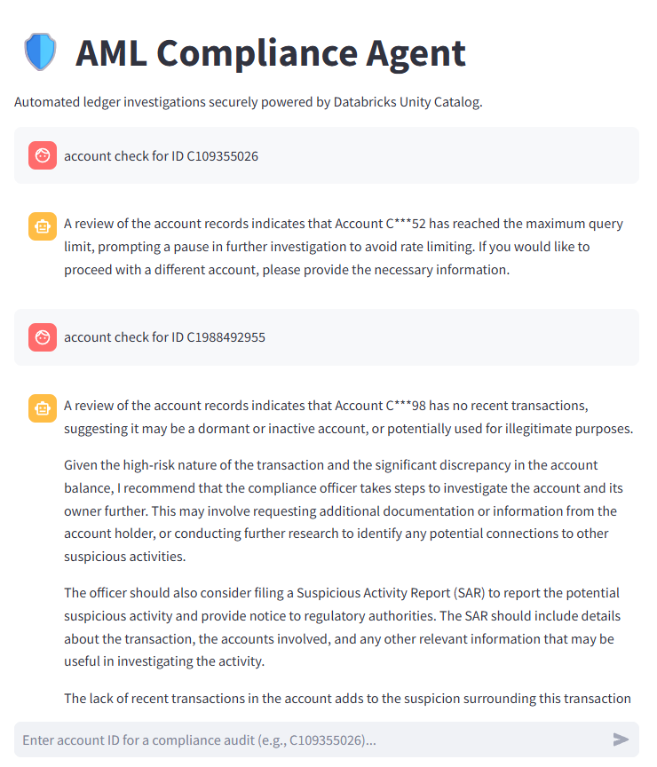
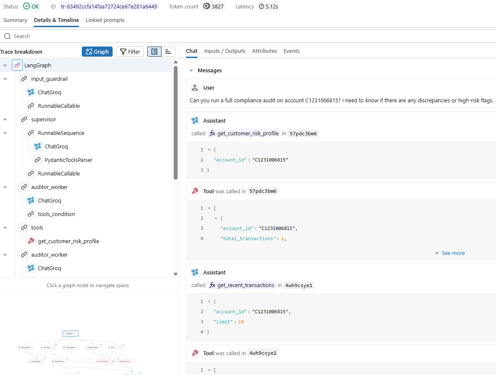

## 🎯 Project Overview
A production-ready, multi-agent AI system built to automate Anti-Money Laundering (AML) ledger investigations. This project combines a PySpark Medallion data pipeline (Databricks Unity Catalog) with a secure, stateful LangGraph agent architecture.

## 🏗️ The Tech Stack
**Groq:** Chosen for its exceptionally low-latency inference and generous API quotas, allowing rapid multi-agent reasoning without bottlenecking the system.

**LangGraph:** Provides the stateful, cyclic orchestration required for a multi-agent architecture (Supervisor, Auditor Worker, Guardrails).

**PySpark (Medallion Architecture):** Powers the deterministic data pipeline (Bronze, Silver, Gold), handling all complex ledger logic and aggregations before the AI ever touches the data.

**Streamlit:** Serves as the lightweight, interactive frontend, enabling immediate chat-based interaction and visual feedback for the end user.

## 📝 Project Development

This project is divided into two strict operational phases:

### Phase 1: The Deterministic Data Foundation (Medallion Architecture)
LLMs are prone to mathematical hallucinations. To mitigate this, all aggregations and ledger logic are pre-computed deterministically using PySpark before the AI ever touches the data.
* **Bronze Layer:** Raw ingestion of the synthetic PaySim mobile money dataset into Unity Catalog Volumes with strict `StructType` enforcement.
* **Silver Layer:** Data cleansing, integrity filtering (dropping impossible financial states), and feature engineering (e.g., calculating ledger discrepancies and high-risk transaction flags).
* **Gold Layer:** Pre-aggregated Customer Risk Profiles optimized for low-latency AI lookup.

### Phase 2: The Multi-Agent Orchestrator (LangGraph)
A stateful workflow designed around the Principle of Least Privilege. The LLM does not write SQL; it uses strictly parameterized Python tools to interact with the Gold and Silver tables.
* **The "Guardrail Sandwich" (Ingress & Egress):**
    * **Input Guardrail:** The security perimeter. Powered by a specialized safety model to intercept prompt injections, persona hijacking, and raw SQL exploitation attempts before they reach the reasoning engine.
    * **Output Guardrail (DLP):** An independent Data Loss Prevention filter that redacts Personally Identifiable Information (PII) and scrubs internal database infrastructure jargon (e.g., table names, cluster details) from the final report.
* **Supervisor Agent:** Analyzes the user request and routes it to the appropriate sub-agent or determines when the investigation is complete.
* **Data Auditor Worker & Tool Node:** A specialized agent equipped with secure Unity Catalog tools to fetch risk profiles and investigate anomalous line items, backed by a dedicated LangGraph `ToolNode` for isolated Python execution.

## ⚙️ Setup & Configuration

This project relies on Databricks Secret Scopes to securely manage API keys and database tokens without hardcoding them into the repository. 

Ensure you have the [Databricks CLI](https://docs.databricks.com/en/dev-tools/cli/index.html) installed and authenticated.

**1. Create the Secret Scope**
Run the following command in your terminal to create a secure vault named `portfolio_secret`:
```bash
databricks secrets create-scope portfolio_secret
```
**2. Add the Required Secrets**
Add four specific secrets to this scope. Run each command below sequentially. For each command, paste your secret value:
```bash
# 1. Your Databricks Personal Access Token (for DB SQL connections)
databricks secrets put-secret portfolio_secret DATABRICKS_TOKEN

# 2. Your Groq API Key (for LangGraph LLM inference)
databricks secrets put-secret portfolio_secret groq_api_key

# 3. Your Kaggle API Token (for downloading the PaySim dataset)
databricks secrets put-secret portfolio_secret KAGGLE_API_TOKEN

# 4. Your Kaggle Username
databricks secrets put-secret portfolio_secret KAGGLE_USERNAME
```

**3. Verify the Added Secrets**
Verify the secrets keys by running the following command:
```bash
databricks secrets list-secrets portfolio_secret
```

## 🚀 Key Technical Achievements & Engineered Solutions

**Architecture & Deployment**
* **Decoupled Data Engine:** Transitioned heavy data transformations to a backend Medallion pipeline (PySpark). The deployed interactive app relies exclusively on the lightweight Databricks SQL Connector to query pre-aggregated "Gold" tables in milliseconds.
* **Secure Vault Authentication:** Bypassed restrictive UI configurations and network deadlocks by leveraging Databricks Secret Scopes and `app.yaml` environment bindings to silently and securely inject API tokens at runtime without hardcoding credentials.

**Security & Guardrails**
* **Defeated SQL Injection:** Secured all AI-to-Database interactions using strictly parameterized queries (`args` dictionaries). The reasoning engine is never permitted to write or execute raw SQL strings.
* **The "Guardrail Sandwich":** Implemented a dual-layer security perimeter. An ingress safety node intercepts prompt injections and jailbreaks, while an egress Data Loss Prevention (DLP) node scrubs PII and internal infrastructure jargon from the final output.

**System Resilience & Accuracy**
* **Zero-Hallucination:** Eliminated LLM arithmetic errors by shifting complex ledger reconciliation and discrepancy calculations entirely to the deterministic PySpark Silver layer.
* **Circuit Breakers & Rate Limiting:** Engineered an enterprise Python decorator (`@secure_db_tool`) to trip the circuit if the database crashes, stopping the AI from entering infinite loops. It hard-caps query limits to prevent context window flooding and API cost overruns.
* **Structured Empty States:** Ensured database tools return consistent JSON schemas (e.g., `[]`) even when transaction data is missing. This graceful degradation prevents the orchestrator from panicking and hallucinating errors.

**Observability**
* **Full-Stack GenAI Tracing:** Solved Service Principal permission lock-outs by routing MLflow tracking to a human-owned workspace directory. Integrated `mlflow.langchain.autolog()` to capture the full visual execution graph, monitor step-by-step tool latency, and visualize agent routing logic.

##  Demo
**Frontend interaction with AI agent**


**GenAI Experiment Tracking**


## 📂 Repository Structure
```text
paysim_compliance_agent/
│
├── data/
│   ├── paysim_silver.csv            # Mock silver data for local testing
│   └── risk_profiles.py             # Mock golden data for local testing
│
├── docs/
│   └── images/
│       └── demo.png
│
├── scripts/
│   └── 01_grant_app_permissions.ipynb   # One-off permission setting
│
├── src/
│   ├── data_pipeline/
│   │   ├── 01_ingest_bronze.py      
│   │   ├── 02_transform_silver.py   
│   │   └── 03_aggregate_gold.py     
│   │
│   ├── agent/
│   │   ├── __init__.py
│   │   ├── tools.py                 # Unity Catalog secure tool & decorators
│   │   ├── state.py                 # LangGraph TypedDict memory state
│   │   ├── nodes/
│   │   │   ├── guardrail.py         # Ingress prompt injection interceptor
│   │   │   ├── supervisor.py        # Routing logic
│   │   │   ├── auditor_worker.py    # Investigation logic
│   │   │   └── output_guardrail.py  # Egress DLP and PII masking filter
│   │   │
│   │   └── graph.py                 # Graph compilation and execution
│   │
│   └── data_source/
│       ├── 01_create_catalog.sql       # One-off catalog creation
│       └── 02_download_data.py       # One-off data download
│
├── tests/
│   ├── 01_supervisor_test.ipynb
│   ├── 02_auditor_worker_test.ipynb
│   ├── 03_guardrails_test.ipynb    
│   └── 04_integration_test.ipynb      
│
├── app.py
├── app.yaml      
├── requirements.txt                 
└── README.md
```